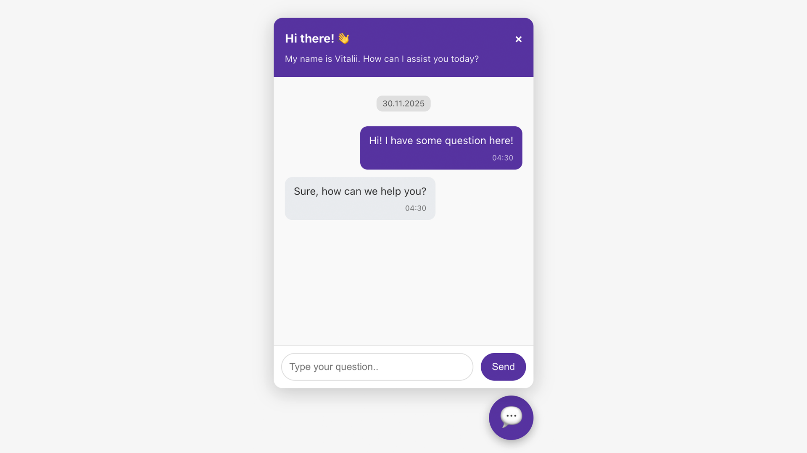
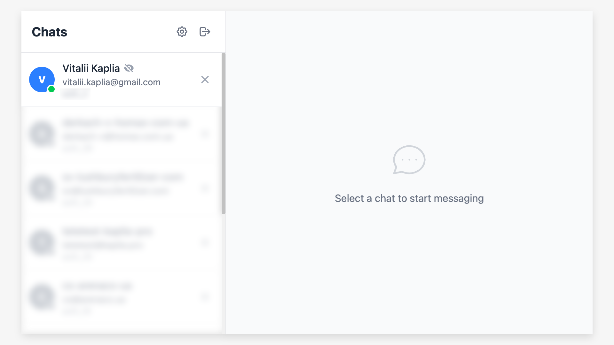

# Kaplia Chat Widget (Working with WebSockets)

A complete, self-hosted live chat solution built with Node.js and WebSockets. It includes a server, a client-side chat widget for your website, and an admin panel for support agents.

## Screenshots

### Chat Widget (Client)

*Embeddable chat widget for website visitors*

### Admin Panel

*Support agent dashboard with real-time chat management*

## Project Overview

This chat application is designed to be a lightweight, performant, and easily deployable live support tool for any website. It provides real-time, two-way communication between your website visitors and your support agents through a clean, modern interface. With a focus on simplicity and flexibility, it can be self-hosted on your own server, giving you full control over your data and infrastructure.

The system is also built to be highly extensible, allowing for powerful integrations with automation platforms like **n8n**, CRMs, or other internal tools through its built-in REST API and Webhook support.

## Features

### Core Features
- **Real-time Communication**: Instant message delivery using WebSockets with synchronization across multiple user tabs.
- **Spy Typing (Real-time Preview)**: Admins can see what users are typing in real-time before they hit send, allowing for faster responses.
- **Origin/CORS Control**: Restrict widget usage to specific domains with wildcard support (e.g., `https://*.example.com`). Empty list allows all origins.
- **Anonymous Users Support**: Separate domain list for anonymous (unauthenticated) visitors. On anonymous domains, WebSocket connects only when the chat widget is opened and disconnects when closed. No tab/page tracking events are sent for anonymous users.
- **GeoIP Detection**: Automatic server-side geolocation using MaxMind databases (city.mmdb, country.mmdb). Detects country, region, city, and IP address for anonymous users. Also parses User-Agent to determine platform (Windows, Mac, Linux, Android, iOS) and browser (Chrome, Firefox, Safari, Edge, Opera).

### Admin Panel (React + Vite)
- **Modern UI**: Rebuilt with React and Vite for better performance and user experience.
- **Mobile Responsive**: Full mobile support with burger menu and swipe gestures for sidebar navigation.
- **Multi-language Support**: Admin panel available in Ukrainian, English, and Russian. Language can be changed in Settings.
- **User Online/Offline Status**: Real-time indicators showing which users are online (green) or offline (gray/semi-transparent). Online users are sorted to the top of the list.
- **Tab Activity Indicator**: Eye icon shows if user's browser tab is active (green eye) or in background (gray crossed eye).
- **Notes Indicator**: Amber document icon appears next to user name when admin notes are saved for that contact. Hovering shows the note text as a tooltip.
- **Edit User Modal**: Pencil button in the sidebar opens a modal to edit user name and admin notes (with validation: name 2-60 chars, notes up to 300 chars). Fully localized in all 3 languages.
- **Admin Typing Indicator**: Animated dots shown in the widget when admin is typing a reply.
- **Flashing Tab Title**: When a new message arrives and the admin panel tab is in the background, the browser tab title flashes with "💬 Нове повідомлення!" to attract attention. Stops automatically when the tab becomes active.
- **Activity Log (System Messages)**: Comprehensive logging of user activity saved to database:
  - 🟢 User connected (opened page with widget)
  - 🔴 User disconnected (closed page)
  - 👁 Tab became active / 👁‍🗨 Tab went to background
  - 💬 Chat opened / ✖️ Chat closed
  - 🔗 Page navigation with URL tracking
- **Granular Log Control**: Toggle each log type independently via button group (Online status, Tab activity, Chat widget, Page visits). Changes apply instantly without save button.
- **Current Page URL**: Shows the current page URL the user is viewing in the chat header.
- **Smart Navigation Detection**: Distinguishes between page navigation and actual tab switches - only logs relevant events.
- **Message Management**: Ability to delete specific messages instantly.
- **Session Management**: View detailed user metadata, System Session IDs, and delete entire chat sessions.
- **Clear Activity Log**: One-click button to delete all system messages from a chat.
- **Customization**: Configure admin passwords, API tokens, and Webhook settings directly from the UI.
- **Consolidated Settings**: All settings (Password, API Token, Webhook, Time, Sound, Messages, Spam, CORS, Anonymous domains) in one modal with tabs.
- **Sound Notifications**: 10 different notification sounds to choose from (Chime, Pop, Ding, Bubble, Magic, Xylophone, Water Drop, Bell, Whistle, Coin). Each sound can be previewed before selection.
- **Remember Me**: Option to stay logged in across browser sessions.
- **Auto-Reconnect**: Automatically reconnects when connection is lost (e.g., when browser tab is in background). No duplicate "login successful" notifications on reconnect.
- **Toast Notifications**: Visual feedback for all actions (save, copy, errors, etc.).

### Spam Protection
- **Rate Limiting**: Configure maximum messages per minute per user (default: 20).
- **Message Length Limit**: Set maximum characters per message (default: 1000).
- **Real-time Feedback**: Users receive instant feedback when limits are exceeded.

### Message Pagination
- **Lazy Loading**: Messages load on scroll (both admin panel and widget).
- **Configurable Limits**: Separate limits for admin panel and widget (default: 50 messages).
- **Smooth Scroll**: Scroll position preserved when loading older messages.

### Connection Stability
- **WebSocket Heartbeat**: Ping/pong mechanism keeps connection alive in background tabs.
- **Event Deduplication**: Prevents spam of repeated system events (60-second window).

### Smart Widget
- **Auto-Open**: The widget automatically expands when an admin sends a reply.
- **Link Parsing**: URLs in messages are automatically detected and converted into clickable links.
- **SVG Icons**: Clean SVG send button (arrow) and chat toggle button (speech bubble) instead of text/emoji.
- **Welcome Messages**: New anonymous users see a personalized greeting ("Вітаємо, Name!") after submitting the name form. Returning users are not greeted again.
- **Persistent Greeting**: The initial greeting message stays visible even when chat history is loaded.
- **Session Reset**: When admin deletes an anonymous session, the widget generates a new session ID and shows the name form again (no auto-reconnect loop).

### Other Features
- **Localization**: Full support for custom Timezones and Date/Time formats to match your business region.
- **Simple Integration**: Easily add the chat widget to any website with a simple JavaScript snippet. Supports both authenticated (with user metadata) and anonymous modes.
- **REST API & Webhooks**: Programmatically send messages and receive notifications for seamless integration with other services.
- **Secure & Self-Hosted**: Run it on your own infrastructure under Nginx with SSL encryption for maximum privacy and control.
- **Automation-Ready**: Perfectly suited for integration with platforms like n8n, Zapier, or Make.

---

## Server Installation and Setup

This guide provides instructions for deploying the chat server on a Debian/Ubuntu-based Linux distribution.

### Step 1: Install Node.js and Nginx

First, update your system packages and install the latest LTS version of Node.js and the Nginx web server.

```bash
# Update system packages
sudo apt update && sudo apt upgrade -y

# Install Nginx
sudo apt install nginx -y

# Add Node.js repository (v20.x) and install Node.js
curl -fsSL https://deb.nodesource.com/setup_20.x | sudo -E bash -
sudo apt install -y nodejs

# Verify installation
node -v
npm -v
```

### Step 2: Place SSL Certificates

For secure communication (WSS), you need SSL certificates. This guide uses Cloudflare Origin Certificates, but any valid certificate will work.

1.  **Create the certificate file**:
    ```bash
    sudo nano /etc/ssl/certs/chat.yourdomain.com.pem
    ```
    Paste your certificate content (e.g., Cloudflare Origin Certificate) into this file. Save and exit.

2.  **Create the private key file**:
    ```bash
    sudo nano /etc/ssl/private/chat.yourdomain.com.key
    ```
    Paste your private key content into this file. Save and exit.

### Step 3: Configure Nginx as a Reverse Proxy

Configure Nginx to handle SSL and forward traffic, including WebSocket connections, to the Node.js application.

1.  **Create an Nginx configuration file**:
    ```bash
    sudo nano /etc/nginx/sites-available/chat.yourdomain.com
    ```

2.  **Paste the following configuration**, replacing `chat.yourdomain.com` with your actual domain and ensuring the `proxy_pass` port matches your Node.js application's port (e.g., 8080).

    ```nginx
    # Redirect HTTP to HTTPS
    server {
        listen 80;
        server_name chat.yourdomain.com;
        return 301 https://$host$request_uri;
    }

    # Main HTTPS server configuration
    server {
        listen 443 ssl;
        server_name chat.yourdomain.com;

        # Paths to your SSL certificates
        ssl_certificate /etc/ssl/certs/chat.yourdomain.com.pem;
        ssl_certificate_key /etc/ssl/private/chat.yourdomain.com.key;

        # SSL optimizations
        ssl_protocols TLSv1.2 TLSv1.3;
        ssl_ciphers HIGH:!aNULL:!MD5;

        location / {
            proxy_pass http://localhost:8080; # Port where your Node.js app runs
            proxy_http_version 1.1;

            # Required headers for WebSocket connections
            proxy_set_header Upgrade $http_upgrade;
            proxy_set_header Connection "upgrade";

            # Forward real client IP address
            proxy_set_header Host $host;
            proxy_set_header X-Real-IP $remote_addr;
            proxy_set_header X-Forwarded-For $proxy_add_x_forwarded_for;
            proxy_set_header CF-Connecting-IP $http_cf_connecting_ip; # If using Cloudflare

            # Increase timeout for long-lived connections
            proxy_read_timeout 86400s; # 24 hours
            proxy_send_timeout 86400s;
        }
    }
    ```

3.  **Activate the site and restart Nginx**:
    ```bash
    sudo ln -s /etc/nginx/sites-available/chat.yourdomain.com /etc/nginx/sites-enabled/
    sudo nginx -t  # Test the configuration
    sudo systemctl restart nginx
    ```

### Step 4: Set Up the Node.js Application

1.  **Create a directory for the application and navigate into it**:
    ```bash
    mkdir ~/chat-server
    cd ~/chat-server
    ```
    *Note: Place the application files (`index.js`, `widget.js`, `admin-panel/dist/`, `geo/`, etc.) in this directory.*

2.  **Initialize the project and install dependencies**:
    ```bash
    npm init -y
    npm install ws express sqlite3 bcryptjs maxmind
    ```

3.  **Add GeoIP databases** (optional, for anonymous user geolocation):
    ```bash
    mkdir geo
    ```
    Place `city.mmdb` and `country.mmdb` files from [MaxMind](https://www.maxmind.com/) into the `geo/` directory. If the files are not present, the server will start without GeoIP support.

### Step 5: Run the Application with PM2

Use [PM2](https://pm2.keymetrics.io/), a process manager for Node.js, to keep your application running continuously.

1.  **Install PM2 globally**:
    ```bash
    sudo npm install -g pm2
    ```

2.  **Start your application**:
    ```bash
    # Replace index.js with your main application file
    pm2 start index.js --name "chat-widget"
    ```

3.  **Enable PM2 to start on server reboot**:
    ```bash
    pm2 save
    pm2 startup
    ```
    *(Run the command that `pm2 startup` outputs to register it with systemd).*

### Step 6: Configure Firewall (UFW)

Ensure that your server's firewall allows web traffic.

```bash
sudo ufw allow OpenSSH
sudo ufw allow 'Nginx Full'
sudo ufw enable
```

### Initial Login Credentials

For a fresh installation, the following default credentials are created. It is **highly recommended** to change these immediately after your first login via the Admin Panel.

-   **Admin Username**: `admin`
-   **Admin Password**: `1122334455667788`
-   **Default API Token**: `MOJrnzS8pQyizRynxuuEJ98y8tPeJMg6`

---

## Client-side Integration

To integrate the chat widget into your website, simply include the `widget.js` script in your HTML. You can also customize its behavior and appearance by defining a `window.KapliaChatConfig` object before the script.

### Basic HTML Integration

Add the following snippet just before your closing `</body>` tag:

```html
<script>
    window.KapliaChatConfig = {
        defaultLanguage: 'en',
        initialMessages: ['Hello! How can I help you today?'],
        i18n: {
            en: {
                title: 'Live Chat 👋',
                subtitle: 'We are here to help!',
                inputPlaceholder: 'Type your question..',
                sendBtn: 'Send'
            },
            ua: {
                title: 'Онлайн підтримка 👋',
                subtitle: 'Ми готові допомогти!',
                inputPlaceholder: 'Введіть своє запитання..',
                sendBtn: 'Надіслати'
            }
        },
        metadata: {
            // Optional: User data to send with messages
            user_id: 'guest_123',
            user_name: 'Guest User',
            user_email: 'guest@example.com'
        }
    };
</script>
<script src="https://chat.yourdomain.com/widget.js"></script>
```

*Note: Replace `https://chat.yourdomain.com` with the actual URL of your deployed chat server.*

### Anonymous Integration (Public Websites)

For public-facing websites where visitors are anonymous, omit the `metadata` field. The server will automatically detect the visitor's location (GeoIP), platform, and browser via User-Agent.

```html
<script>
    window.KapliaChatConfig = {
        defaultLanguage: 'en',
        initialMessages: ['Hello! How can I help you today?'],
        i18n: {
            en: {
                title: 'Live Chat',
                subtitle: 'We are here to help!',
                inputPlaceholder: 'Type your question..',
                sendBtn: 'Send'
            }
        }
    };
</script>
<script src="https://chat.yourdomain.com/widget.js"></script>
```

For anonymous mode to work, add the website domain to **Settings -> Anonymous domains** in the Admin Panel. On anonymous domains:
- WebSocket connects only when the user opens the chat widget (not on page load)
- WebSocket disconnects when the user closes the chat widget
- Tab visibility and page navigation events are not tracked
- GeoIP and User-Agent data is collected automatically on the server side

### Example Client Page

For a full working example of how to embed and configure the chat widget, refer to the `chat-client/chat.html` file in this repository. It demonstrates a basic HTML page with the chat widget integrated, showing how to pass initial configuration and metadata.

## Use Cases & Integrations

### Integration with n8n (or other automation tools)

This chat widget is perfect for building automated support workflows with platforms like **n8n**, Zapier, or Make. By combining Webhooks and the REST API, you can create a seamless, real-time bridge between your website visitors and your backend systems, such as a support team on Telegram.

**Example Workflow: Website Chat -> n8n -> Telegram**

1.  **Receive a Message**: A user sends a message on your website. The chat server instantly fires a **Webhook** with the message content and user metadata.
2.  **Catch the Webhook in n8n**: Create an n8n workflow that starts with a **Webhook node**. Use the URL from this node in the chat's Admin Panel.
3.  **Process and Forward**: The n8n workflow receives the data. You can parse the user's name, email, and message. Then, use the **Telegram node** to forward this message to a private support channel, notifying your team instantly.
4.  **Reply from Telegram**: Your support agent replies in the Telegram channel.
5.  **Send the Reply Back**: An n8n workflow can listen for replies from the agent on Telegram. It then uses the **HTTP Request node** to call the chat's **REST API**, sending the agent's message back to the correct user on the website in real-time.

This creates a powerful, two-way communication channel, allowing your team to manage customer support from a platform like Telegram, while n8n handles the automation in between.

---

## API & Webhook Documentation

The application provides a REST API for sending messages and a Webhook system for receiving them.

### Authentication

-   **Base URL**: `https://chat.yourdomain.com/`
-   **API Token**: Your unique token, which can be managed in the Admin Panel (`Settings -> API Token`).

### Receiving Messages (Webhook)

The server can send an instant notification to a specified URL whenever a user sends a message. This is the primary way to integrate incoming messages with external systems.

#### 1. How to Configure
1.  Go to the Chat Admin Panel.
2.  Navigate to **⚙️ Options -> 🔗 Webhook**.
3.  Enter the full URL of your listener (e.g., your n8n Webhook node URL).
4.  Check the **"Enable sending"** box and click **"Save"**.

#### 2. Request Details
-   **Method**: `POST`
-   **Headers**: `Content-Type: application/json`
-   **Trigger**: Fires immediately when a new message is received from a client.

#### 3. Request Body (JSON Payload)
The server sends a JSON object containing the message text and all available session metadata.

**Example Payload (authenticated user):**
```json
{
  "session_data": [
    {
      "session_id": "user_am6ysq",
      "metadata": {
        "user_session": "Ukraine, Kyiv Oblast, Olenivka (31.43.52.185), Mac, Chrome",
        "user_id": "2",
        "user_name": "Vitaliy Kaplia",
        "user_email": "vitalii.kaplia@gmail.com"
      },
      "updated_at": "2025-11-27 06:35:27"
    }
  ],
  "message_text": "Hello, I have a question about my order!"
}
```

**Example Payload (anonymous user):**
```json
{
  "session_data": [
    {
      "session_id": "guest_k7x2m9",
      "metadata": {
        "user_session": "Germany, Bavaria, Munich, Windows, Chrome",
        "user_name": "Смілива Коала",
        "user_id": "guest-k7x2m9",
        "user_email": "anonymous",
        "geo": "Germany, Bavaria, Munich (85.214.132.45)",
        "platform": "Windows",
        "browser": "Chrome",
        "ip": "85.214.132.45"
      },
      "updated_at": "2025-12-15 14:22:10"
    }
  ],
  "message_text": "Hi, I need help with pricing"
}
```

### Sending Messages (REST API)

This API allows you to programmatically send messages from a backend system (like an n8n workflow) to a specific user on your website.

#### 1. Get Chat ID (`targetId`)
First, you need the `session_id` of the user. This is typically received from the initial webhook.

-   **Request**: `GET /?get-all-chats-api=true&token=YOUR_API_TOKEN`
    *(This endpoint can also be used to list all active chats.)*

#### 2. Send a Message
-   **Endpoint**: `/?send-message-to-chat-api=true`
-   **Method**: `POST` (recommended) or `GET`
-   **Content-Type**: `application/json` or `application/x-www-form-urlencoded`

**Request Parameters**:

| Parameter                | Type    | Description                                                 |
| ------------------------ | ------- | ----------------------------------------------------------- |
| `send-message-to-chat-api` | `true`  | **Required.** A flag to activate the send message mode.     |
| `token`                  | `string`| **Required.** Your API token.                               |
| `targetId`               | `string`| **Required.** The `session_id` of the user you want to message. |
| `message`                | `string`| **Required.** The text of the message.                      |

**Code Examples**:

**PHP (cURL) Example:**
```php
<?php

$url = 'https://chat.yourdomain.com/?send-message-to-chat-api=true';
$token = 'MOJrnzS8pQyizRynxuuEJ98y8tPeJMg6';

$data = [
    'token'    => $token,
    'targetId' => 'user_k92lx8', // The chat ID to send to
    'message'  => 'Hello from a PHP script! 🚀'
];

$ch = curl_init($url);
curl_setopt($ch, CURLOPT_RETURNTRANSFER, true);
curl_setopt($ch, CURLOPT_POST, true);
curl_setopt($ch, CURLOPT_POSTFIELDS, http_build_query($data));

$response = curl_exec($ch);
$httpCode = curl_getinfo($ch, CURLINFO_HTTP_CODE);
curl_close($ch);

if ($httpCode == 200) {
    echo "Success: " . $response;
} else {
    echo "Error ($httpCode): " . $response;
}
?>
```

**JavaScript (Fetch) Example:**
```javascript
const sendMessage = async (chatId, text) => {
    const url = 'https://chat.yourdomain.com/?send-message-to-chat-api=true';
    const data = {
        token: 'MOJrnzS8pQyizRynxuuEJ98y8tPeJMg6',
        targetId: chatId,
        message: text
    };

    try {
        const response = await fetch(url, {
            method: 'POST',
            headers: {
                'Content-Type': 'application/json'
            },
            body: JSON.stringify(data)
        });

        const result = await response.json();
        console.log(result);
    } catch (error) {
        console.error('Error sending message:', error);
    }
};

// Usage
sendMessage('user_k92lx8', 'Hello from the JS console!');
```

**Server Responses**:

-   **Success (200 OK)**:
    ```json
    {
        "status": "success",
        "sent_to": "user_k92lx8"
    }
    ```
-   **Authorization Error (403 Forbidden)**:
    ```json
    {
        "error": "Invalid Token"
    }
    ```
-   **Bad Request (400 Bad Request)**:
    ```json
    {
        "error": "Missing targetId or message"
    }
    ```

---

## Admin Panel Development

The admin panel is built with React and Vite. If you want to modify it:

### Prerequisites
- Node.js 18+ installed

### Development

```bash
cd chat-server/admin-panel

# Install dependencies
npm install

# Start development server
npm run dev
```

The dev server runs on `http://localhost:5173` by default.

### Building for Production

```bash
cd chat-server/admin-panel
npm run build
```

This creates optimized files in `admin-panel/dist/` directory that are served by the main Node.js server.

### Project Structure

```
chat-server/
├── index.js              # Main server (WebSocket + HTTP API)
├── widget.js             # Client-side chat widget
├── deploy-webhook.js     # GitHub webhook receiver (port 9000)
├── deploy.sh             # Auto-deploy shell script
├── .env                  # Telegram bot token & chat ID (not in git)
├── geo/                  # MaxMind GeoIP databases (optional)
│   ├── city.mmdb
│   └── country.mmdb
├── admin-panel/
│   ├── src/
│   │   ├── components/   # React components (Modal, Sidebar, ChatArea, EditUserModal, etc.)
│   │   ├── context/      # React Context for state management
│   │   ├── hooks/        # Custom hooks (useWebSocket)
│   │   ├── i18n/         # Internationalization (uk.json, en.json, ru.json)
│   │   ├── utils/        # Utilities (sounds, titleNotification, dateUtils, linkUtils)
│   │   ├── App.jsx       # Main application component
│   │   └── main.jsx      # Entry point
│   ├── dist/             # Production build (served by server)
│   └── package.json
└── package.json
```

---

## Auto-Deploy Setup

The project supports automatic deployment via GitHub webhooks. When you push to the `master` branch, the server automatically pulls the latest code, rebuilds the admin panel, and restarts.

### How It Works

```
git push → GitHub webhook → deploy-webhook.js (port 9000) → deploy.sh → pm2 restart → Telegram notification
```

### Server Setup

1. **Set the webhook secret** as an environment variable. Generate one with:
    ```bash
    node -e "console.log(require('crypto').randomBytes(32).toString('hex'))"
    ```

2. **Start the deploy webhook** with PM2:
    ```bash
    cd ~/chat-server
    DEPLOY_SECRET=your_secret_here pm2 start deploy-webhook.js --name "deploy-hook"
    pm2 save
    ```

3. **Add Nginx location** for the webhook. In your existing server block (`/etc/nginx/sites-available/chat.kaplia.pro`), add:
    ```nginx
    location /deploy {
        proxy_pass http://localhost:9000/deploy;
        proxy_set_header X-Hub-Signature-256 $http_x_hub_signature_256;
        proxy_set_header Content-Type $content_type;
    }
    ```
    Then reload Nginx:
    ```bash
    sudo nginx -t && sudo systemctl reload nginx
    ```

4. **Allow port 9000** in firewall (only needed if not proxying through Nginx):
    ```bash
    sudo ufw allow 9000
    ```

### GitHub Setup

1. Go to your repository on GitHub → **Settings** → **Webhooks** → **Add webhook**
2. **Payload URL**: `https://chat.kaplia.pro/deploy`
3. **Content type**: `application/json`
4. **Secret**: Same secret you set in step 1
5. **Events**: Select "Just the push event"
6. Click **Add webhook**

### Telegram Notifications

After a successful deploy, the script sends a Telegram message with the commit hash and message. To enable:

1. Create a `.env` file in `~/chat-server/`:
    ```
    TELEGRAM_BOT_TOKEN=your_bot_token
    TELEGRAM_CHAT_ID=your_chat_id
    ```

2. The `.env` file is loaded automatically by `deploy.sh`. Notifications are optional — if variables are not set, deploy works without them.

### Deploy Logs

All deploy activity is logged to `deploy.log` in the chat-server directory:
```bash
tail -f ~/chat-server/deploy.log
```

### Manual Deploy

You can still trigger a deploy manually:
```bash
cd ~/chat-server && bash deploy.sh
```

---

## License

MIT License - feel free to use this project for personal or commercial purposes.